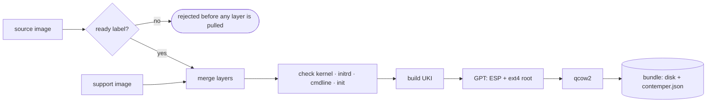

# How conversion works

`contemper convert --target <target> <source-ref>` runs six steps:

| Step | What happens |
| --- | --- |
| 1. Check readiness | Read the manifest and config, require `io.contemper.ready`. No layers are pulled. |
| 2. Pull and merge | Walk the layers bottom to top, applying whiteouts and opaque directories, producing the merged filesystem a container runtime would see. |
| 3. Resolve support | Read the target's support image and evaluate its variants against the merged view. |
| 4. Overlay | Merge the support image's layers on top, as a final `COPY --from=` stage would. |
| 5. Validate | Check the merged filesystem against the [fixed-path contract](authoring.md#the-fixed-path-contract), plus any paths the support image requires. |
| 6. Assemble | Write the target's output: a UEFI-bootable disk with a Unified Kernel Image, as qcow2. |

Steps 1, 2 and 4 are identical for every target. Steps 3 and 5 are
target-specific but driven entirely by *data*: labels on support
images, which can be republished without a contemper release. Only step 6
is target-specific code inside contemper.

## Nothing from your image runs

Every step above reads manifests and files. Detection, selection and
validation are read-only inspection, and no binary from an image is ever
run on the machine doing the conversion. That keeps the trust surface
small, removes any need for a container runtime at conversion time, and
makes cross-architecture builds unremarkable: an arm64 disk builds on an
x86-64 host with no emulation, because there is no guest code to run.

## Building the disk without root

The root filesystem is never unpacked onto the host under its own file
names. contemper creates an empty ext4 filesystem with `mkfs.ext4` and
fills it through a generated `debugfs` script, reading file contents
from the merged layers. Ownership, permissions, device nodes, symlinks
and hardlinks come through intact, with no root privileges and no
assumption that the host filesystem is case-sensitive (the default macOS
filesystem isn't).

The ext4 feature set is fixed rather than inherited from the host's
`/etc/mke2fs.conf`: `has_journal`, `extent`, `huge_file`, `flex_bg`,
`metadata_csum`, `64bit`, `dir_nlink` and `extra_isize`, with a 4 KiB
block size. contemper passes its own configuration to `mkfs.ext4`, so the
same image gives the same filesystem whichever e2fsprogs version converts
it. Newer e2fsprogs releases enable features such as `orphan_file` by
default, and a guest whose initrd carries an older `e2fsck` (for example
1.46 on Enterprise Linux 9 or Ubuntu 22.04) refuses to check such a
filesystem at boot.

The raw disk image is written sparse: the unused part of the root
partition, which is most of it in a fresh image, is never written, so
building a disk with a large `--root-size` costs little time or
temporary space. A `disk.raw` kept with `--keep-raw` is sparse too, on
file systems that support it.

The boot image is a Unified Kernel Image (UKI), assembled in Go: an
embedded systemd-stub with the OS release, command line, initrd and
kernel appended as PE sections. A gzip-compressed kernel is decompressed
first. See
[internal/uki/stubs/README.md](https://github.com/contemper-project/contemper/blob/main/internal/uki/stubs/README.md)
for where the embedded stub comes from and how to verify it.

## Progress output

`convert` narrates each stage on stderr as it runs: the source and
platform, the readiness check, one line per layer, what each fixed path
resolved to, and the sizes of the pieces being assembled. stdout carries
the bundle path (one path per line when a run converts several
architectures), so scripts can capture it.

- `--progress auto|tty|plain`: `auto` (the default) shows a live spinner
  and timer on a terminal and plain lines otherwise, including in CI and
  when `NO_COLOR` or `TERM=dumb` is set. While the disk is assembled,
  the spinner line names the current step (`staging 4096 / 9626 files`,
  `writing ext4 42%`, `checking ext4`, `converting to qcow2 87%`);
  plain output keeps one line for the whole stage.
- `-v, --verbose`: also show each host tool invocation. Their own output
  is otherwise shown only when they fail.
- `-q, --quiet`: no progress output.

## What comes out

A [bundle](../reference/bundle.md): a directory holding `disk.qcow2` and a
`contemper.json` manifest recording where the disk came from and what it
needs to be deployed.
